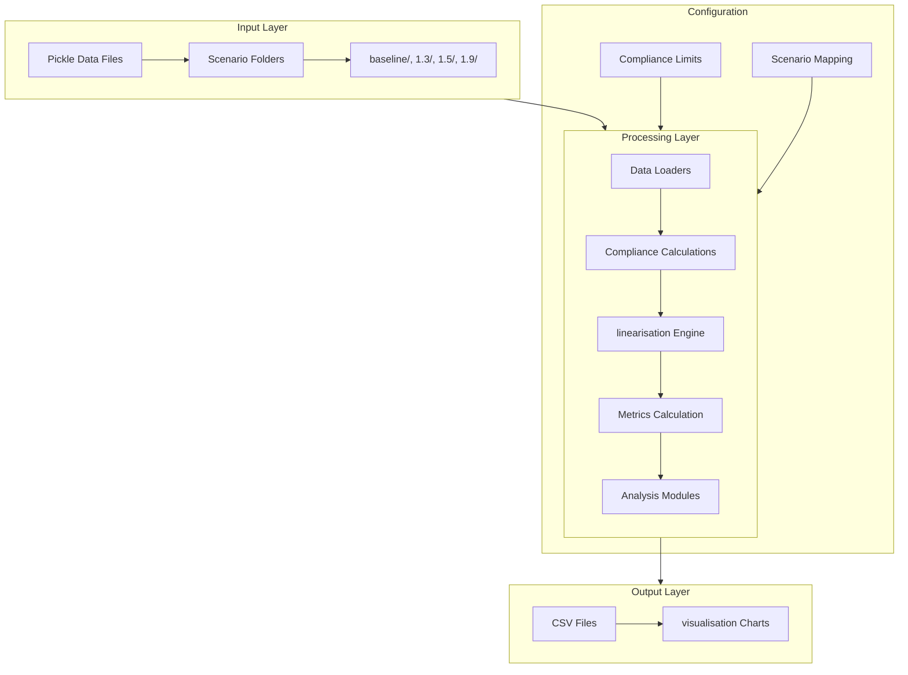
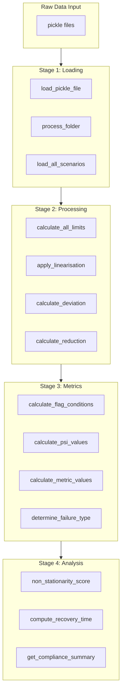
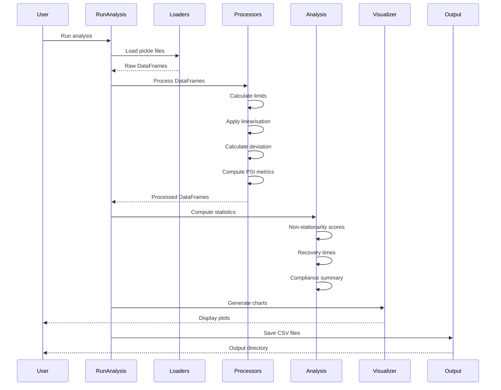
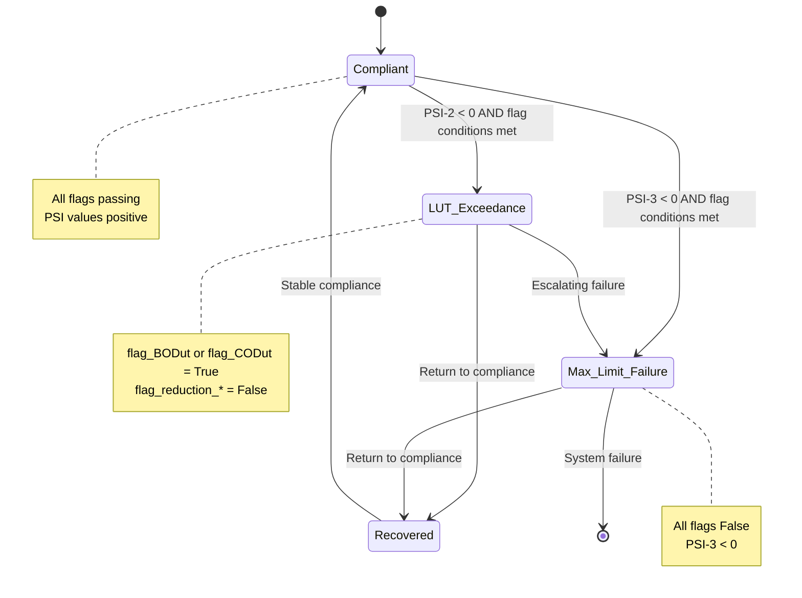

# Non-Linearity Analysis Framework for Wastewater Treatment Simulation

## Purpose Statement

This project provides a comprehensive framework for analysing Biochemical Oxygen Demand (BOD) and Chemical Oxygen Demand (COD) data from wastewater treatment simulations. The analysis pipeline assesses regulatory compliance with defined BOD/COD limits, identifies non-stationarity in treatment performance, and computes recovery times from non-compliance events. The framework is designed to support both technical analysis and executive decision-making by generating structured compliance reports, statistical summaries, and visualisation outputs.

## Overview

The Non-Linearity Analysis Framework is a Python-based pipeline that processes simulation data from wastewater treatment scenarios with varying load conditions. It computes Performance Sustainability Index (PSI) values, determines compliance status, analyses temporal patterns in treatment efficiency, and quantifies recovery times following regulatory exceedances. The system supports multiple load scenarios (baseline, 130%, 150%, and 190% of nominal loading) and produces both CSV data outputs and visualisation charts for comprehensive reporting.

---

## Architecture

### System Architecture Diagram



### Data Processing Pipeline



### Module Structure

```
src/nonlinearity/
├── __init__.py                 # Package initialization
├── config.py                   # Configuration and compliance limits
├── data/
│   ├── __init__.py
│   ├── loaders.py              # Data loading functions
│   └── validators.py           # Data validation utilities
├── core/
│   ├── __init__.py
│   ├── compliance.py           # BOD/COD limit calculations
│   ├── linearisation.py        # linearisation functions
│   ├── metrics.py              # PSI and metric calculations
│   └── processors.py           # Main processing pipeline
├── analysis/
│   ├── __init__.py
│   ├── nonstationarity.py      # Non-stationarity scoring
│   ├── recovery.py              # Recovery time analysis
│   └── statistics.py            # Statistical computations
├── visualisation/
│   ├── __init__.py
│   ├── charts.py                # Bar charts and line plots
│   ├── histograms.py            # Concentration histograms
│   ├── plots.py                 # General plotting utilities
│   └── scatter.py               # Scatter plot functions
└── utils/
    ├── __init__.py
    ├── decorators.py            # Utility decorators
    ├── file_helpers.py          # File handling utilities
    └── logging_config.py       # Logging configuration
```

---

## Key Components

### Configuration ([`config.py`](src/nonlinearity/config.py))

The configuration module defines compliance limits, project paths, and scenario mappings:

**Compliance Limits:**
| Parameter | Value | Description |
|-----------|-------|-------------|
| `bod_upper` | 50 mg/L | Upper BOD limit |
| `bod_lower` | 25 mg/L | Lower BOD limit |
| `cod_upper` | 250 mg/L | Upper COD limit |
| `cod_lower` | 125 mg/L | Lower COD limit |
| `bod_pc` | 0.7 | BOD percentage factor |
| `cod_pc` | 0.75 | COD percentage factor |

**Simulation Configuration ([`SimulationConfig`](src/nonlinearity/config.py:38)):**
| Parameter | Value | Description |
|-----------|-------|-------------|
| `TIME_STEP` | 0.08 days | Simulation time step |
| `HOURS_PER_DAY` | 24 | Hours per day |
| `MINUTES_PER_HOUR` | 60 | Minutes per hour |

**Scenario Configuration:**
```python
SCENARIOS = {
    "baseline": "baseline",   # Normal operating conditions
    "130%": "1.3",           # 130% of nominal load
    "150%": "1.5",           # 150% of nominal load
    "190%": "1.9",           # 190% of nominal load
}
```

### Data Loading ([`data/loaders.py`](src/nonlinearity/data/loaders.py:16))

Key functions for loading simulation data:

| Function | Purpose |
|----------|---------|
| [`load_pickle_file()`](src/nonlinearity/data/loaders.py:16) | Load a single pickle file |
| [`process_folder()`](src/nonlinearity/data/loaders.py:37) | Process all pickle files in a folder |
| [`load_all_scenarios()`](src/nonlinearity/data/loaders.py:108) | Load and process all scenario folders |
| [`get_data_summary()`](src/nonlinearity/data/loaders.py:145) | Create summary statistics |

**Required Input Columns:**
- `bod1` - BOD influent concentration
- `cod1` - COD influent concentration  
- `bod31` - BOD effluent concentration
- `cod31` - COD effluent concentration
- `snh1` - Influent ammonia concentration
- `snh31` - Effluent ammonia concentration

### Core Processing

#### Compliance ([`core/compliance.py`](src/nonlinearity/core/compliance.py:13))

Calculates BOD and COD compliance limits:

```python
def calculate_bod_limits(df: pd.DataFrame, limits: ComplianceLimits) -> pd.DataFrame
def calculate_cod_limits(df: pd.DataFrame, limits: ComplianceLimits) -> pd.DataFrame
def calculate_all_limits(df: pd.DataFrame, limits: ComplianceLimits) -> pd.DataFrame
def calculate_flag_conditions(df: pd.DataFrame) -> pd.DataFrame
```

#### linearisation ([`core/linearisation.py`](src/nonlinearity/core/linearisation.py:11))

Applies min-max normalisation to BOD and COD data:

```python
def linearise_bod(df: pd.DataFrame) -> pd.DataFrame
def linearise_cod(df: pd.DataFrame) -> pd.DataFrame
def apply_linearisation(df: pd.DataFrame) -> pd.DataFrame
def calculate_deviation_columns(df: pd.DataFrame) -> pd.DataFrame
def calculate_reduction_columns(df: pd.DataFrame, bod_pc: float, cod_pc: float) -> pd.DataFrame
```

#### Metrics ([`core/metrics.py`](src/nonlinearity/core/metrics.py:23))

Computes Performance Sustainability Index (PSI) values:

```python
def calculate_psi_values(df: pd.DataFrame) -> pd.DataFrame
def calculate_metric_values(df: pd.DataFrame) -> pd.DataFrame
def determine_failure_type(df: pd.DataFrame) -> pd.DataFrame
def process_dataframe(df: pd.DataFrame, limits: ComplianceLimits) -> pd.DataFrame
```

#### Processors ([`core/processors.py`](src/nonlinearity/core/processors.py:17))

Main pipeline orchestration:

```python
def process_scenario(scenario_key: str, data_dir: Path, config: ComplianceLimits) -> pd.DataFrame
def run_full_analysis(root_path: Path, save_output: bool) -> Dict[str, pd.DataFrame]
def get_scenario_summary(results: Dict[str, pd.DataFrame]) -> pd.DataFrame
```

### Analysis Modules

#### Non-Stationarity ([`analysis/nonstationarity.py`](src/nonlinearity/analysis/nonstationarity.py:13))

Analyzes temporal variability in treatment performance:

```python
def non_stationarity_score(series: pd.Series, window: int = 30) -> float
def compute_nonstationarity_table(results: dict, columns: List[str]) -> pd.DataFrame
def compute_rolling_statistics(series: pd.Series, window: int = 30) -> pd.DataFrame
```

#### Recovery ([`analysis/recovery.py`](src/nonlinearity/analysis/recovery.py:13))

Computes recovery times from non-compliance events. The `time_step` parameter defaults to `SimulationConfig.TIME_STEP` (0.08 days):

```python
def compute_recovery_time(series: pd.Series, time_step: float = None) -> List[float]
def compute_recovery_time_minutes(series: pd.Series, time_step: float = None) -> List[float]
def compute_mean_recovery_time(series: pd.Series, time_step: float = None) -> float
def get_recovery_analysis(results: dict, time_step: float = None) -> pd.DataFrame
```

#### Statistics ([`analysis/statistics.py`](src/nonlinearity/analysis/statistics.py:13))

Statistical analysis functions:

```python
def compute_summary_stats(df: pd.DataFrame, columns: List[str]) -> pd.DataFrame
def compute_cv(df: pd.DataFrame, columns: List[str]) -> pd.Series
def get_compliance_summary(results: Dict[str, pd.DataFrame]) -> pd.DataFrame
def compute_exceedance_analysis(results: Dict[str, pd.DataFrame]) -> Dict
```

### visualisation ([`visualisation/charts.py`](src/nonlinearity/visualisation/charts.py:15))

Chart generation functions:

```python
def plot_comparison_bars(results: Dict[str, pd.DataFrame], output_dir: Path) -> plt.Figure
def plot_recovery_histogram(results: Dict[str, pd.DataFrame], time_step: float = None) -> plt.Figure
def plot_mean_recovery_time(results: Dict[str, pd.DataFrame], time_step: float = None) -> plt.Figure
```

---

## Data Flow

### Sequence Diagram



### Input Data Formats

**Input:** Pickle files (`*.pkl`) containing pandas DataFrames with the following columns:

| Column | Type | Description |
|--------|------|-------------|
| `bod1` | float | BOD at inlet (mg/L) |
| `cod1` | float | COD at inlet (mg/L) |
| `bod31` | float | BOD at outlet (mg/L) |
| `cod31` | float | COD at outlet (mg/L) |
| `snh1` | float | NH3-N at inlet (mg/L) |
| `snh31` | float | NH3-N at outlet (mg/L) |

**Scenario Structure:**
```
data/
├── baseline/       # Normal loading conditions
│   ├── profile_run_1.pkl
│   ├── profile_run_2.pkl
│   └── ... (7 files)
├── 1.3/           # 130% of baseline loading
│   ├── profile_run_1.pkl
│   └── ...
├── 1.5/           # 150% of baseline loading
│   └── ...
└── 1.9/           # 190% of baseline loading
    └── ...
```

### Output Data Formats

**CSV Files:** Generated in `output/csv/` directory:
- `{scenario}_processed.csv` - Full processed data
- `compliance_summary.csv` - Compliance statistics
- `nonstationarity.csv` - Non-stationarity scores
- `recovery_analysis.csv` - Recovery time statistics

---

## Compliance Framework

### BOD/COD Limits and Thresholds

| Parameter | Lower Limit | Upper Limit | Percentage Factor |
|-----------|-------------|-------------|-------------------|
| BOD | 25 mg/L | 50 mg/L | 0.70 |
| COD | 125 mg/L | 250 mg/L | 0.75 |

### Failure Types

| Failure Type | Description | Condition |
|--------------|-------------|-----------|
| **Compliant** | Within regulatory limits | All conditions met |
| **LUT Exceedance** | Look-Up Table threshold exceeded | PSI-2 < 0 with specific flag conditions |
| **Max Limit Failure** | Maximum limit exceeded | PSI-3 < 0 with specific flag conditions |

### Compliance State Diagram



---

## Usage

### Running the Analysis

Execute the main analysis pipeline using the run script:

```bash
python run_analysis.py
```

### Programmatic Usage

```python
from pathlib import Path
from nonlinearity.config import get_config
from nonlinearity.core.processors import run_full_analysis
from nonlinearity.analysis.statistics import get_compliance_summary
from nonlinearity.analysis.nonstationarity import compute_nonstationarity_table
from nonlinearity.analysis.recovery import get_recovery_analysis

# Get configuration
config, paths = get_config(Path("c:/code_projects/python_projects/non_linearity_code"))

# Run full analysis
results = run_full_analysis(root_path=paths.root, save_output=True)

# Get compliance summary
summary = get_compliance_summary(results)
print(summary)

# Get non-stationarity analysis
ns_table = compute_nonstationarity_table(results)
print(ns_table)

# Get recovery analysis
recovery = get_recovery_analysis(results)
print(recovery)
```

### Processing Individual Scenarios

```python
from nonlinearity.core.processors import process_scenario
from nonlinearity.config import get_config, SCENARIOS

# Get configuration
config, paths = get_config()

# Process a single scenario
df = process_scenario(
    scenario_key="130%",
    data_dir=paths.data,
    config=config,
    output_dir=paths.csv_output,
    save_csv=True
)

print(f"Processed {len(df)} records")
print(df['fail_type'].value_counts())
```

---

## Metrics & Analysis

### Performance Sustainability Index (PSI)

The PSI is a composite metric that evaluates treatment performance against regulatory thresholds. It consists of multiple components:

**BOD PSI Calculations:**
```python
# PSI-1: Initial performance assessment
bod_psi_1_min = min(BODlt - BODeffl, bodp)
bod_psi_1 = max(BODlt - BODeffl, bod_psi_1_min)

# PSI-2: LUT-based assessment
bod_psi_2 = min(BODlt - BODeffl, bodp, BODut - BODeffl)

# PSI-3: Maximum limit assessment
bod_psi_3 = min(BODut - BODeffl, bodp)
```

**Metric Aggregation:**
```python
# Look-Up Table metric
metric_lut = min(bod_psi_2, cod_psi_2)

# Maximum limit metric
metric_max = min(bod_psi_3, cod_psi_3)

# Final metric selection based on conditions
metric = select([cond_lut, cond_max], [metric_lut, metric_max], default=max(bod_psi_1, cod_psi_1))
```

### Non-Stationarity Scoring

The non-stationarity score measures temporal variability in treatment performance:

```python
def non_stationarity_score(series, window=30):
    """
    Score = mean(|rolling_var - overall_var|) / overall_var
    
    Higher scores indicate greater non-stationarity.
    """
    rolling_var = series.rolling(window=window).var()
    overall_var = series.var()
    
    score = (rolling_var - overall_var).abs().mean() / overall_var
    return float(score)
```

**Interpretation:**
- Score ≈ 0: Stationary process
- Score 0-0.5: Mild non-stationarity
- Score 0.5-1.0: Moderate non-stationarity
- Score > 1.0: Strong non-stationarity

### Recovery Time Computation

Recovery time measures the duration from the end of a non-compliance period back to compliance:

```python
def compute_recovery_time(series, time_step=0.08):
    """
    Calculate recovery times in simulation units.
    
    Args:
        series: fail_type column values
        time_step: Time step in simulation units (default: 0.08)
    
    Returns:
        List of recovery times in time_step units
    """
    recovery_times = []
    non_compliance_duration = 0
    in_non_compliance = False
    
    for failure_type in series:
        if failure_type in ('Max Limit Failure', 'LUT Exceedance'):
            in_non_compliance = True
            non_compliance_duration += 1
        else:
            if in_non_compliance:
                recovery_times.append(non_compliance_duration * time_step)
                non_compliance_duration = 0
                in_non_compliance = False
    
    return recovery_times

def compute_recovery_time_minutes(series, time_step=0.08):
    """Convert recovery times to minutes."""
    recovery_times = compute_recovery_time(series, time_step)
    return [time * time_step * 24 * 60 for time in recovery_times]
```

---

## Output

### CSV Outputs

| File | Description |
|------|-------------|
| `{scenario}_processed.csv` | Full processed dataset with all calculated columns |
| `compliance_summary.csv` | Compliance counts by scenario and failure type |
| `nonstationarity.csv` | Non-stationarity scores for each variable |
| `recovery_analysis.csv` | Recovery time statistics by scenario |

### visualisation Outputs

| File | Description |
|------|-------------|
| `compliance_comparison.png` | Bar chart comparing compliance across scenarios |
| `recovery_histogram.png` | Histogram of recovery times |
| `mean_recovery.png` | Line chart of mean recovery times |
| `scatter_*.png` | Scatter plots of BOD/COD relationships |
| `histogram_*.png` | Concentration distribution histograms |

### Key Output Columns

Processed CSV files include:

| Column | Description |
|--------|-------------|
| `BODut`, `BODlt` | BOD upper/lower threshold values |
| `CODut`, `CODlt` | COD upper/lower threshold values |
| `LIN_BODi`, `LIN_BODe` | linearisad BOD influent/effluent |
| `LIN_CODi`, `LIN_CODe` | linearisad COD influent/effluent |
| `BODlt-BODeffl`, `CODlt-CODeffl` | Deviation from lower thresholds |
| `BODut-BODeffl`, `CODut-CODeffl` | Deviation from upper thresholds |
| `bod_psi_1`, `bod_psi_2`, `bod_psi_3` | BOD PSI components |
| `cod_psi_1`, `cod_psi_2`, `cod_psi_3` | COD PSI components |
| `metric_lut`, `metric_max` | Aggregated metrics |
| `fail_type` | Compliance status |
| `fail_source` | BOD or COD source of failure |

---

## Dependencies

```toml
[project]
dependencies = [
    "pandas>=2.0.0",
    "numpy>=1.24.0",
    "matplotlib>=3.7.0",
    "loguru>=0.7.0",
]

[project.optional-dependencies]
dev = [
    "pytest>=7.0.0",
    "pytest-cov>=4.0.0",
]
```

---

## License

This project is developed in collaboration with NYU. See LICENSE file for details.
